# Azure AKS Cluster Deployment

This project demonstrates how to deploy a basic Kubernetes cluster (AKS) on Microsoft Azure, deploy an Nginx web application, expose it to the internet using a LoadBalancer, and clean up resources afterward.

## Project Summary

- **Cloud Platform**: Microsoft Azure
- **Orchestration**: Kubernetes (AKS)
- **Tools Used**: Azure CLI, kubectl, WSL2 (Ubuntu)
- **App Deployed**: Nginx Web Server

---

## Project Steps

### 1. Create Resource Group
```bash
az group create --name aks-resource-group --location centralus
```

### 2. Create AKS Cluster
```bash
az aks create --resource-group aks-resource-group --name aks-cluster --node-count 1 --enable-addons monitoring --generate-ssh-keys --node-vm-size Standard_B2s
```

### 3. Install kubectl and Connect to Cluster
```bash
curl -LO "https://dl.k8s.io/release/$(curl -L -s https://dl.k8s.io/release/stable.txt)/bin/linux/amd64/kubectl"
chmod +x kubectl
mkdir -p ~/bin
mv kubectl ~/bin/kubectl
export PATH=$PATH:$HOME/bin
source ~/.bashrc
kubectl version --client
```

### 4. Connect to AKS Cluster
```bash
az aks get-credentials --resource-group aks-resource-group --name aks-cluster
```

### 5. Deploy Nginx to the Cluster
```bash
kubectl create deployment nginx-deployment --image=nginx
kubectl get deployments
kubectl get pods
```

### 6. Expose Nginx Deployment
```bash
kubectl expose deployment nginx-deployment --port=80 --type=LoadBalancer
kubectl get services
```

### 7. Clean Up Resources
```bash
az group delete --name aks-resource-group --yes --no-wait
az group list
```

---

## Screenshots

| Step | Screenshot |
|:---|:---|
| AKS Cluster Created (Part 1) | 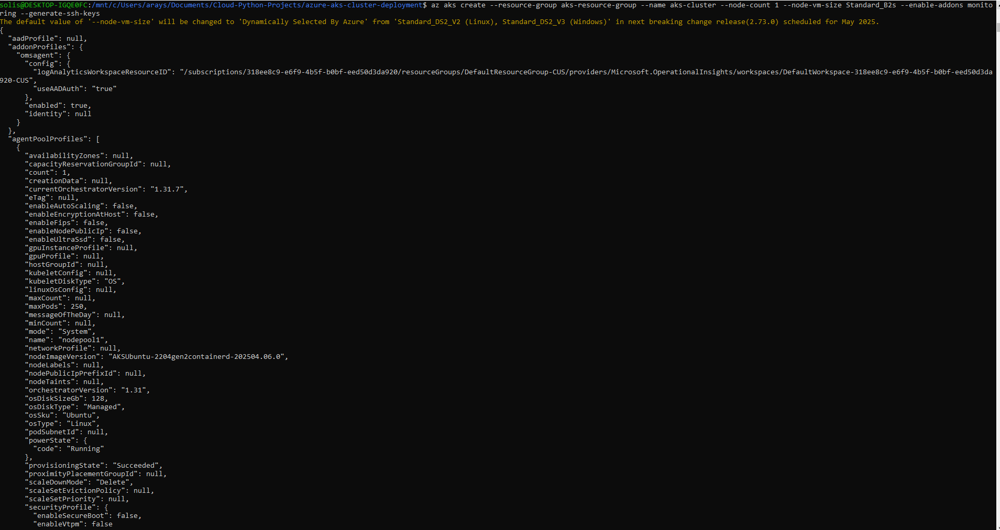 |
| AKS Cluster Created (Part 2) | 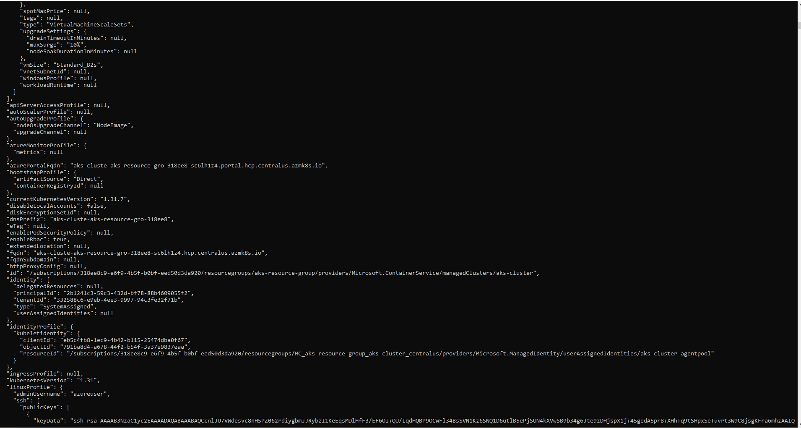 |
| AKS Cluster Created (Part 3) | 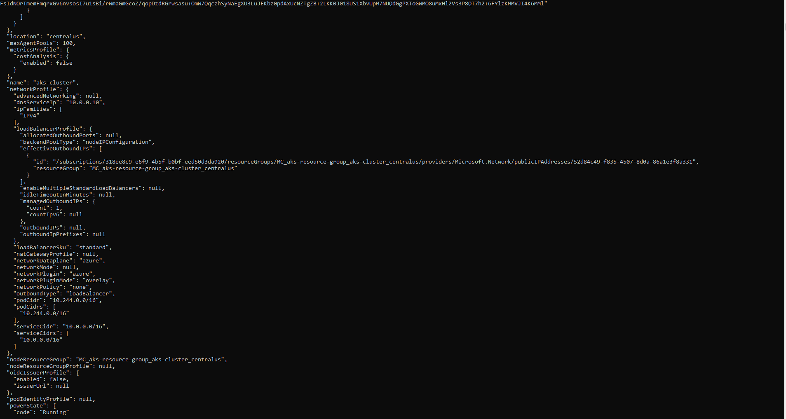 |
| AKS Cluster Created (Part 4) | 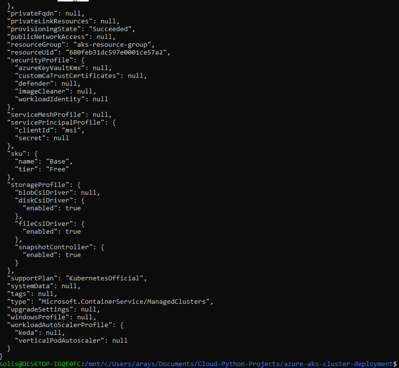 |
| Connected to Cluster | 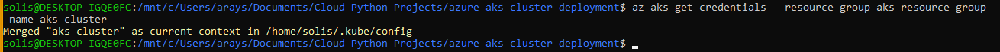 |
| kubectl Installed | 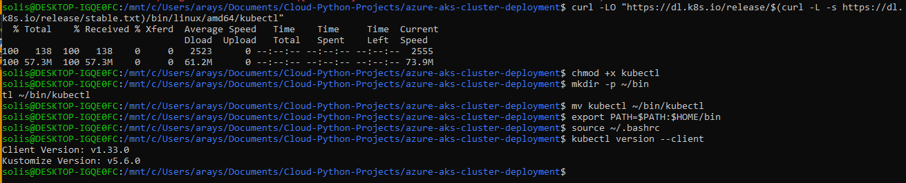 |
| Nginx Deployment Created | 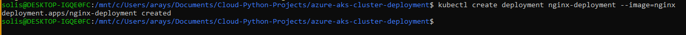 |
| Get Deployments Output | 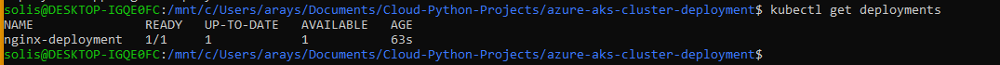 |
| Get Pods Output | 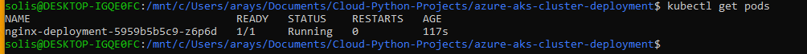 |
| Get Services Output | 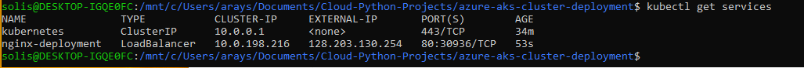 |
| Nginx Service Exposed | 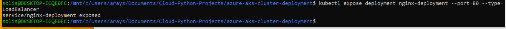 |
| Resource Group Deleted (Command) | 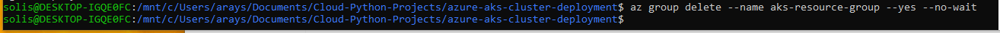 |
| Resource Group Deleted (Confirmation 1) | 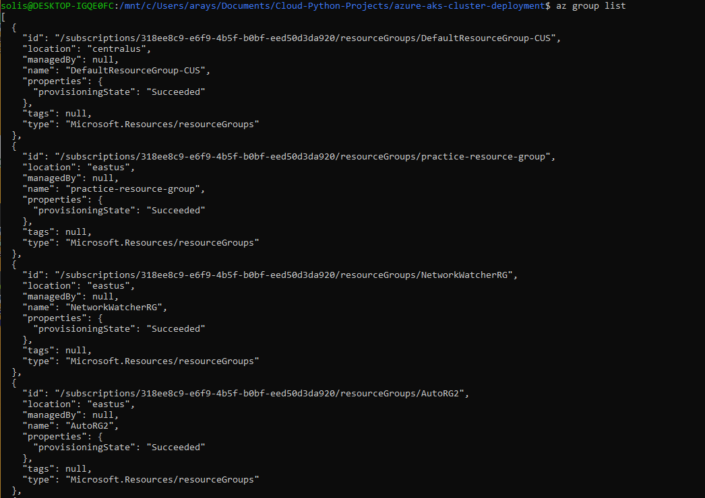 |
| Resource Group Deleted (Confirmation 2) | 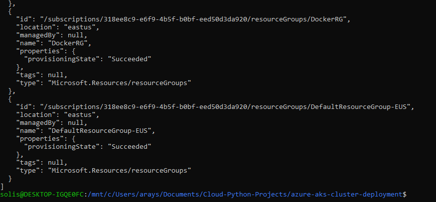 |

---

## Future Improvements

- Automate entire AKS deployment with a single Bash script
- Expand deployment with custom Docker containers
- Add ingress controller for advanced routing

---

## Author

- **Anthony Solis** — [GitHub Profile](https://github.com/ASolis2)

---


